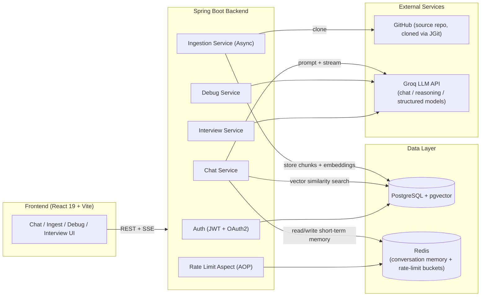
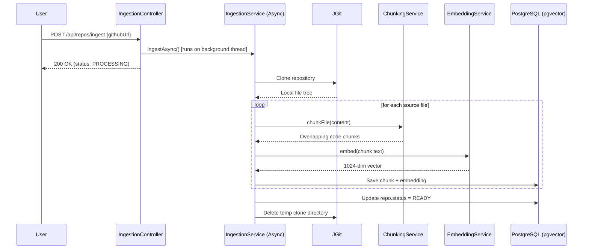
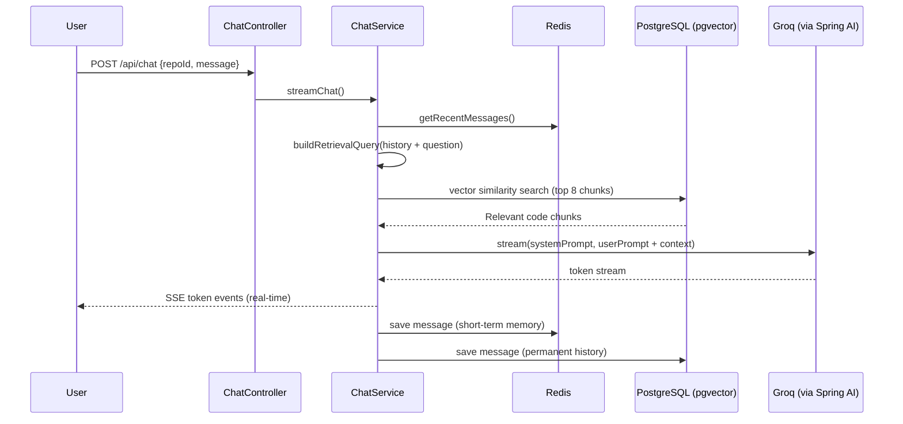
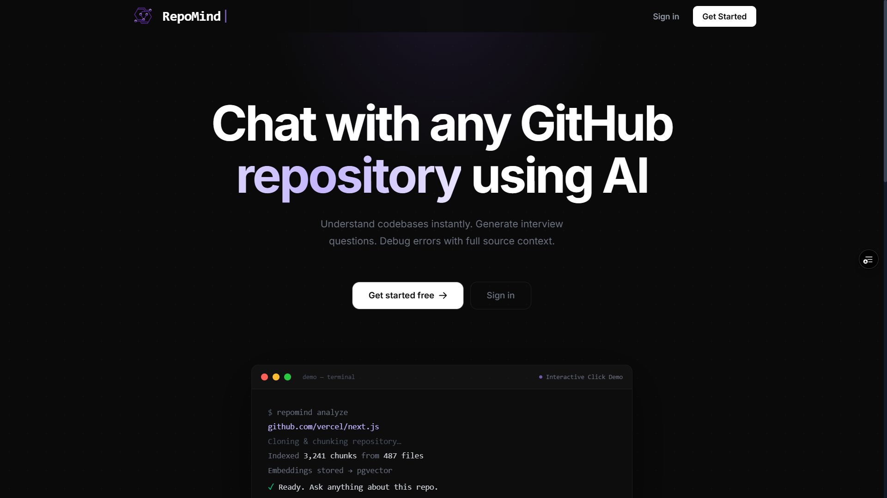
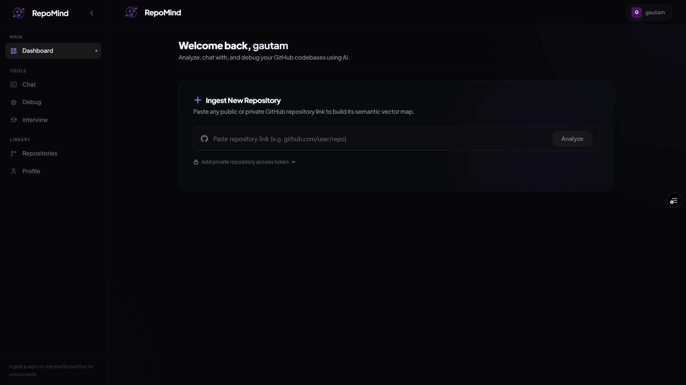
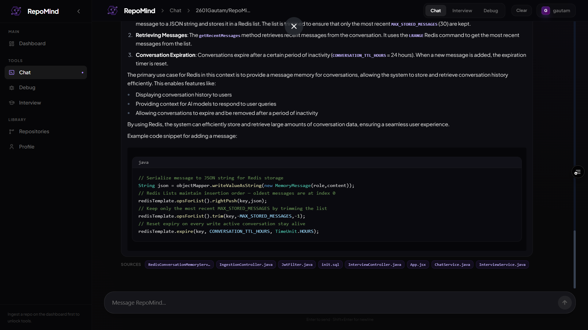
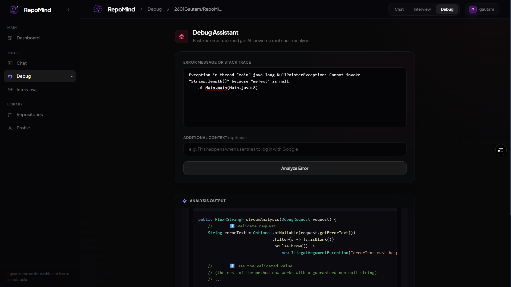
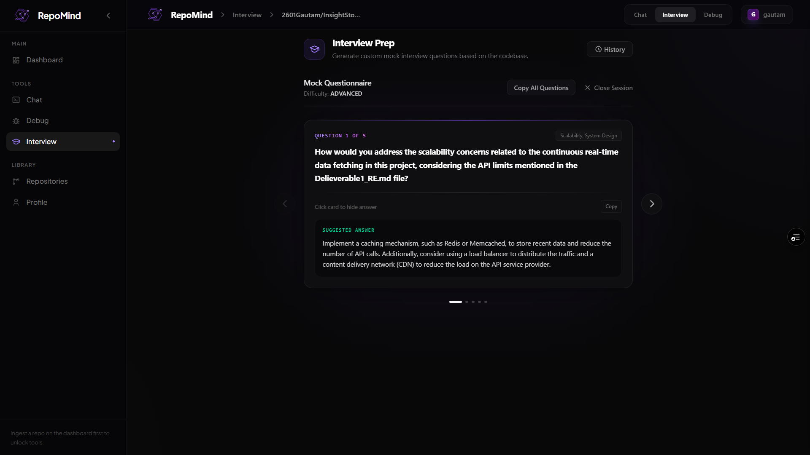

# RepoMind

### Chat with any GitHub repository — powered by Retrieval-Augmented Generation (RAG)

RepoMind ingests a public or private GitHub repository, understands its codebase, and lets you ask it questions in plain English — with answers grounded in the actual source code, not guesswork.

<p align="center">
  
  
  
  
  
  
  
</p>

---

## Table of Contents

- [Overview](#overview)
- [Problem Statement](#problem-statement)
- [Solution](#solution)
- [Key Features](#key-features)
- [Architecture](#architecture)
- [Technology Stack](#technology-stack)
- [Project Structure](#project-structure)
- [Getting Started](#getting-started)
- [Configuration and Environment Variables](#configuration-and-environment-variables)
- [Running Locally](#running-locally)
- [Docker](#docker)
- [Usage Guide](#usage-guide)
- [API Overview](#api-overview)
- [Screenshots](#screenshots)
- [Roadmap and Future Improvements](#roadmap-and-future-improvements)
- [Contributing](#contributing)
- [Authors](#authors)
- [Acknowledgements](#acknowledgements)

---

## Overview

**RepoMind** is a full-stack AI application that turns any GitHub repository into an interactive, queryable knowledge base. Point it at a repo URL, and once ingestion completes, you can chat with the codebase — ask where something is implemented, how a module works, or why a piece of logic exists — and get answers grounded in the real code, complete with file names and line numbers.

Beyond chat, RepoMind also includes an AI-assisted error/debug analyzer and an auto-generated interview Q&A feature based on the ingested codebase.

## Problem Statement

Understanding an unfamiliar codebase — whether it's a new job's repo, an open-source project, or your own project months later — is slow. Traditional code search (grep, IDE search) requires knowing the right keywords, and reading through hundreds of files just to answer a simple architectural question doesn't scale. General-purpose AI chatbots can't help either, since they were never trained on your specific, often-private repository, and cannot fit an entire codebase into a single prompt.

## Solution

RepoMind solves this with **Retrieval-Augmented Generation (RAG)**:

1. The repository is cloned, split into overlapping code chunks, and converted into vector embeddings stored in PostgreSQL (via the `pgvector` extension).
2. When you ask a question, RepoMind embeds your question, retrieves the most semantically relevant chunks of code, and feeds them — along with your question — to an LLM.
3. The LLM is instructed to answer **only from the retrieved code**, and to say so explicitly if the answer isn't present, minimizing hallucination and keeping every answer traceable back to real files.

The result: accurate, source-grounded answers about a codebase the AI model has never seen before, without any fine-tuning.

---

## Key Features

- **Conversational Codebase Chat** — Ask natural-language questions about any ingested repository and get streamed, real-time answers (via Server-Sent Events) with cited source files.
- **Automated Repository Ingestion** — Paste a GitHub URL; RepoMind clones it (via JGit), extracts source files, chunks them intelligently, and generates embeddings — all asynchronously in the background.
- **Context-Aware Chunking** — Uses a sliding-window chunking strategy with overlap so functions and logical blocks are never split across chunk boundaries.
- **Semantic Vector Search** — Powered by PostgreSQL's `pgvector` extension using cosine-similarity nearest-neighbor search, scoped per repository.
- **Multi-Turn Conversational Memory** — Redis-backed short-term memory (with TTL expiry) keeps track of recent conversation context so follow-up questions make sense, while PostgreSQL retains permanent chat history.
- **AI-Powered Debug Analyzer** — A dedicated `/api/debug` flow using a lower-temperature "reasoning" LLM client tuned for careful error analysis.
- **Auto-Generated Interview Questions** — Generates structured interview-style Q&A based on the ingested repository, using a low-temperature, structured-output LLM client.
- **Secure Authentication** — Stateless JWT authentication (HttpOnly cookies), BCrypt password hashing, plus Google and GitHub OAuth2 login.
- **API Rate Limiting** — Token-bucket rate limiting (Bucket4j) applied declaratively via a custom `@RateLimit` annotation and an AOP aspect.
- **Real-Time Token Streaming** — Answers stream token-by-token to the frontend using reactive `Flux` + SSE, instead of waiting for the full response.
- **Per-User Repository Dashboard** — Every ingested repo, its ingestion status (`PROCESSING` / `READY` / `FAILED`), and its conversations are scoped to the authenticated user.

---

## Architecture

### High-Level System Diagram



### Ingestion Pipeline



### Chat / Query Pipeline



> **Note on ingestion status:** the underlying schema (`init.sql`) defines a `PENDING → PROCESSING → READY/FAILED` state machine, though the actively used ingestion flow primarily transitions through `PROCESSING → READY/FAILED`.

---

## Technology Stack

### Backend
| Category | Technology |
|---|---|
| Language | Java 21 |
| Framework | Spring Boot |
| AI Orchestration | Spring AI 2.0.0 (`spring-ai-starter-model-openai`, `spring-ai-starter-model-mistral-ai`) |
| LLM Provider | Groq (accessed via Spring AI's OpenAI-compatible client) |
| Embedding Model | Mistral AI (`mistral-embed`) |
| Database | PostgreSQL with the `pgvector` extension |
| Caching / Memory | Redis (`spring-boot-starter-data-redis`) |
| Auth | JWT (`jjwt-api`, `jjwt-impl`, `jjwt-jackson`), Spring Security, OAuth2 Client (Google & GitHub) |
| Rate Limiting | Bucket4j (`bucket4j_jdk17-core`, `bucket4j_jdk17-lettuce`) via a custom AOP aspect |
| Repository Access | JGit (`org.eclipse.jgit`) |
| Reactive/Streaming | Spring WebFlux (`Flux`), Server-Sent Events |
| Utilities | Lombok, Spring Retry, Spring Dotenv |
| Build Tool | Maven (via `mvnw` wrapper) |

### Frontend
| Category | Technology |
|---|---|
| Framework | React 19 |
| Build Tool | Vite |
| Routing | React Router |
| Styling | Tailwind CSS (`@tailwindcss/typography`) |
| HTTP Client | Axios |
| Markdown / Code Rendering | `react-markdown`, `remark-gfm`, `react-syntax-highlighter` |
| Icons | `lucide-react` |

### Infrastructure
| Category | Technology |
|---|---|
| Containerization | Docker (multi-stage build: Maven → Eclipse Temurin JRE Alpine) |
| Backend Hosting | Render |
| Frontend Hosting | Vercel |
| Database Hosting | NeonDB (managed PostgreSQL, referenced in `application-prod.yml`) |

---

## Project Structure

```
RepoMind/
├── Dockerfile                          # Multi-stage build: Maven build → JRE Alpine runtime
├── init.sql                            # Database schema: users, repositories, code_chunks, etc.
├── pom.xml                             # Maven dependencies & build config
├── mvnw / mvnw.cmd                     # Maven wrapper scripts
│
├── src/main/java/com/repomind/repomind/
│   ├── config/                         # AiConfig (LLM beans), SecurityConfig, CacheConfig, CorsConfig
│   ├── controller/                     # ChatController, IngestionController, DebugController,
│   │                                    # AuthController, InterviewController, HealthController
│   ├── service/
│   │   ├── ingestion/                  # FileCloneService, ChunkingService, EmbeddingService
│   │   ├── ChatService.java            # Core RAG chat/streaming logic
│   │   ├── IngestionService.java       # Async repo ingestion orchestration
│   │   ├── RedisConversationMemoryService.java
│   │   ├── RateLimitService.java
│   │   └── PromptBuilder.java
│   ├── security/                       # JwtFilter, JwtUtil, OAuth2SuccessHandler
│   ├── aspect/                         # RateLimitAspect (AOP)
│   ├── repository/                     # Spring Data JPA repositories (incl. native pgvector query)
│   ├── entity/                         # User, RepoEntity, CodeChunk, Conversation, Message, etc.
│   ├── dto/                            # Request/response DTOs
│   └── annotation/                     # Custom @RateLimit annotation
│
├── src/main/resources/
│   ├── application.yml                 # Base configuration
│   └── application-prod.yml            # Production overrides (DB, Redis, OAuth2, model routing)
│
└── frontend/
    ├── package.json
    ├── vite.config.js
    └── src/
        ├── api/client.js                # Axios API client
        ├── context/AuthContext.jsx      # Auth state management
        ├── components/
        │   ├── chat/  debug/  repo/  layout/  common/
        └── pages/
            ├── LandingPage.jsx
            ├── LoginPage.jsx / RegisterPage.jsx / OAuthCallbackPage.jsx
            ├── DashboardPage.jsx / AllReposPage.jsx
            ├── IngestPage.jsx
            ├── ChatPage.jsx
            ├── DebugPage.jsx
            ├── InterviewPage.jsx
            └── ProfilePage.jsx
```

---

## Getting Started

### Prerequisites

- **Java 21** (JDK)
- **Maven** (or use the included `mvnw` wrapper)
- **Node.js** (v18+) and **npm** — for the frontend
- **PostgreSQL** with the `pgvector` extension installed
- **Redis** (local instance or a managed service)
- API keys for:
  - **Groq** (chat/reasoning/structured LLM inference)
  - **Mistral AI** (embeddings)
  - **Google OAuth2** and **GitHub OAuth2** (optional, only if you want social login)

### Clone the repository

```bash
git clone https://github.com/2601Gautam/RepoMind.git
cd RepoMind
```

---

## Configuration and Environment Variables

RepoMind reads secrets and environment-specific values via environment variables (loaded through `spring-dotenv`, i.e. a `.env` file at the project root, or your platform's native environment variables). Based on `application.yml` and `application-prod.yml`, the following variables are used:

| Variable | Required | Description |
|---|---|---|
| `JWT_SECRET` | Yes | Secret key used to sign JWTs. Must be at least 256 bits (32+ characters). |
| `DATABASE_URL` | Yes (prod) | PostgreSQL connection string (e.g. from NeonDB). |
| `DB_USER` | Yes (prod) | Database username. |
| `DB_PASSWORD` | Yes (prod) | Database password. |
| `REDIS_URL` | Yes (prod) | Redis connection URL. |
| `GROQ_API_KEY` | Yes | API key for Groq (LLM inference). |
| `GROQ_CHAT_MODEL` | No | Overrides the default fast chat model (`meta-llama/llama-4-scout-17b-16e-instruct`). |
| `GROQ_REASONING_MODEL` | No | Overrides the default reasoning model (`meta-llama/llama3-70b-8192`). |
| `GROQ_STRUCTURED_MODEL` | No | Overrides the default structured-output model (`meta-llama/mixtral-8x7b-32768`). |
| `MISTRAL_API_KEY` | Yes | API key for Mistral AI (used for embeddings). |
| `GOOGLE_CLIENT_ID` / `GOOGLE_CLIENT_SECRET` | No | Required only if enabling Google OAuth2 login. |
| `GITHUB_CLIENT_ID` / `GITHUB_CLIENT_SECRET` | No | Required only if enabling GitHub OAuth2 login. |
| `CORS_ALLOWED_ORIGIN` | No | Frontend origin allowed by CORS (defaults to `http://localhost:5173`). |

> **Note:** The repository does not include a `.env.example` file. Create your own `.env` file in the project root based on the table above before running the app. Never commit real secrets to version control.

Example `.env` (for local development):

```env
JWT_SECRET=replace_with_a_long_random_secret_at_least_32_characters
DATABASE_URL=jdbc:postgresql://localhost:5432/repomind
DB_USER=postgres
DB_PASSWORD=postgres
REDIS_URL=redis://localhost:6379
GROQ_API_KEY=your_groq_api_key
MISTRAL_API_KEY=your_mistral_api_key
CORS_ALLOWED_ORIGIN=http://localhost:5173
```

### Database Setup

Run the provided `init.sql` against your PostgreSQL instance to create the required extensions (`vector`, `uuid-ossp`) and tables (`users`, `repositories`, `code_chunks`, and related tables):

```bash
psql -U postgres -d repomind -f init.sql
```

> Note: `application.yml` sets `ddl-auto: validate` — meaning Hibernate will **validate** the schema against your entities but will **not** auto-create tables. Running `init.sql` first is required.

---

## Running Locally

### 1. Backend (Spring Boot)

```bash
./mvnw clean install
./mvnw spring-boot:run
```

The backend starts on `http://localhost:8080` by default (Spring Boot's default port, unless configured otherwise).

### 2. Frontend (React + Vite)

```bash
cd frontend
npm install
npm run dev
```

The frontend starts on Vite's default dev server (typically `http://localhost:5173`).

> Vite bakes environment variables into the build **at build time**. If you configure a custom API base URL for the frontend, make sure it's set correctly before running `npm run build` for production.

---

## Docker

A `Dockerfile` is provided for the **backend** using a multi-stage build (Maven build stage → lightweight Eclipse Temurin JRE Alpine runtime image):

```bash
# Build the image
docker build -t repomind-backend .

# Run the container
docker run -p 8080:8080 --env-file .env repomind-backend
```

> Note: The repository currently provides a Dockerfile for the **backend only**. There is no `docker-compose.yml` or frontend Dockerfile in the repo at this time — running PostgreSQL, Redis, and the frontend locally alongside the container is a manual setup step.

---

## Usage Guide

1. **Register / Log in** — create an account (email/password) or sign in with Google/GitHub OAuth2.
2. **Ingest a Repository** — from the dashboard, submit a public (or token-authenticated private) GitHub repository URL. RepoMind clones, chunks, and embeds it in the background; progress is shown via polling the repo's status.
3. **Chat** — once a repo's status is `READY`, open the Chat page and ask questions in natural language. Answers stream in real time and cite the specific files they were drawn from.
4. **Debug** — use the Debug page to paste an error/stack trace and get an AI-assisted analysis grounded in the ingested repository's code.
5. **Interview Prep** — generate structured interview-style questions and answers based on the ingested codebase from the Interview page.
6. **Manage Repositories** — view all your ingested repositories, their status, and delete ones you no longer need from the "All Repos" page.

---

## API Overview

All endpoints are prefixed under `/api`. Authentication uses a JWT stored in an HttpOnly cookie, set after login/registration/OAuth2.

### Auth — `/api/auth`
| Method | Endpoint | Description |
|---|---|---|
| POST | `/api/auth/register` | Register a new user |
| POST | `/api/auth/login` | Log in and receive a JWT (HttpOnly cookie) |
| GET | `/api/auth/me` | Get the current authenticated user |
| POST | `/api/auth/logout` | Log out (clears the auth cookie) |
| GET | `/api/auth/profile/stats` | Get profile statistics for the current user |

### Repository Ingestion — `/api/repos`
| Method | Endpoint | Description |
|---|---|---|
| POST | `/api/repos/ingest` | Submit a GitHub URL for asynchronous ingestion |
| GET | `/api/repos/{repoId}/status` | Poll ingestion status/progress |
| GET | `/api/repos` | List all repositories for the current user |
| DELETE | `/api/repos/{repoId}` | Delete a repository and its associated data |

### Chat — `/api/chat`
| Method | Endpoint | Description |
|---|---|---|
| POST | `/api/chat` | Ask a question; streams the answer via Server-Sent Events |
| GET | `/api/chat/history/{repoId}` | Get chat history for a repository |
| DELETE | `/api/chat/conversations/{conversationId}` | Delete a conversation |

### Debug — `/api/debug`
| Method | Endpoint | Description |
|---|---|---|
| POST | `/api/debug/analyze` | Stream an AI-assisted analysis of an error/bug, grounded in the ingested repo |

### Interview — `/api/interview`
| Method | Endpoint | Description |
|---|---|---|
| POST | `/api/interview/generate` | Generate structured interview Q&A for a repository |
| GET | `/api/interview/sessions/{sessionId}` | Get a specific interview session |
| GET | `/api/interview/sessions` | List all interview sessions for the current user |

### Health — `/api/health` *(inferred base path)*
| Method | Endpoint | Description |
|---|---|---|
| GET | `/health` | Health check endpoint (used for uptime pings) |

> Formal API documentation (e.g. Swagger/OpenAPI) is not currently generated in this repository — the table above is derived directly from the controller source code.

---

## Screenshots

> Screenshots are not yet included in the repository. Add images to a `docs/screenshots/` folder and reference them below.

## Screenshots

### Landing Page


### Dashboard


### Chat Interface


### Debug Analyzer


### Interview Prep


---

## Roadmap and Future Improvements

- [ ] **Query condensing** — use a dedicated LLM call to rewrite follow-up questions into standalone queries for more accurate retrieval (current implementation uses a simpler heuristic of prepending recent conversation context).
- [ ] **Distributed rate limiting and caching** — move rate-limit buckets and the cache manager to Redis-backed implementations to support true horizontal scaling across multiple backend instances.
- [ ] **API documentation** — add Swagger/OpenAPI documentation for all endpoints.
- [ ] **Automated tests** — expand test coverage (currently scaffolded via `spring-boot-starter-test` and `spring-security-test`).
- [ ] **Docker Compose** — provide a full `docker-compose.yml` covering backend, frontend, PostgreSQL, and Redis for one-command local setup.
- [ ] **Screenshots and demo video** — add visual documentation of the UI.
- [ ] **License** — add an explicit open-source license.

---

## Contributing

Contributions are welcome! To contribute:

1. Fork the repository
2. Create a feature branch: `git checkout -b feature/your-feature-name`
3. Commit your changes: `git commit -m "Add your feature"`
4. Push to your branch: `git push origin feature/your-feature-name`
5. Open a Pull Request describing your changes

Please open an issue first for major changes to discuss what you'd like to change.

---

## Authors

**Gautam Modi** ([@2601Gautam](https://github.com/2601Gautam))
B.Tech ICT student, Dhirubhai Ambani University (DAU), Gandhinagar

**Diya Patel** ([@DiyaPatel007](https://github.com/DiyaPatel007))
B.Tech ICT-CS student, Dhirubhai Ambani University (DAU), Gandhinagar

---

## Acknowledgements

- [Spring AI](https://spring.io/projects/spring-ai) — for LLM/embedding orchestration within the Spring ecosystem
- [pgvector](https://github.com/pgvector/pgvector) — for enabling vector similarity search directly in PostgreSQL
- [Groq](https://groq.com/) — for fast LLM inference
- [Mistral AI](https://mistral.ai/) — for the embedding model
- [JGit](https://www.eclipse.org/jgit/) — for pure-Java Git repository access
- [Bucket4j](https://bucket4j.com/) — for token-bucket rate limiting
- [NeonDB](https://neon.tech/) — managed serverless PostgreSQL used in production

