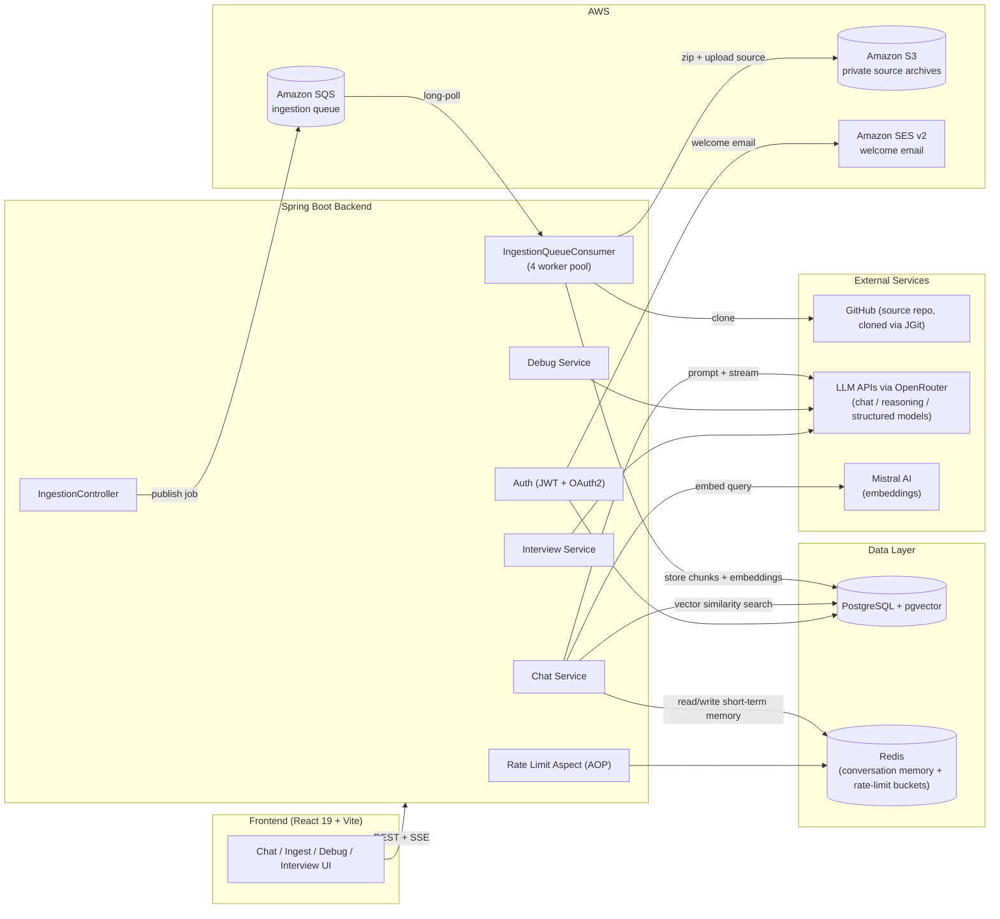
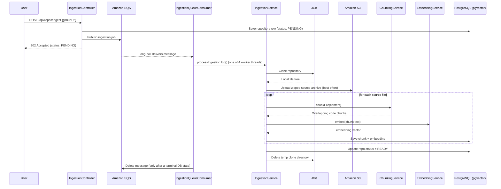
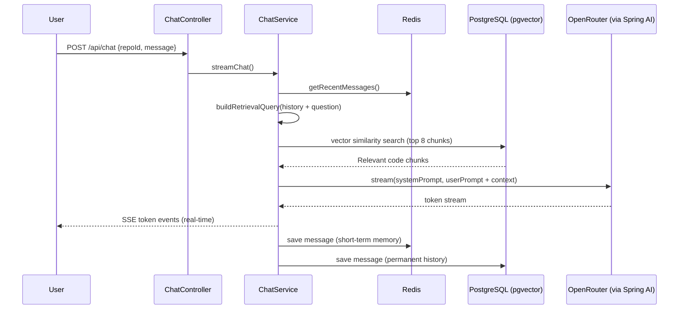
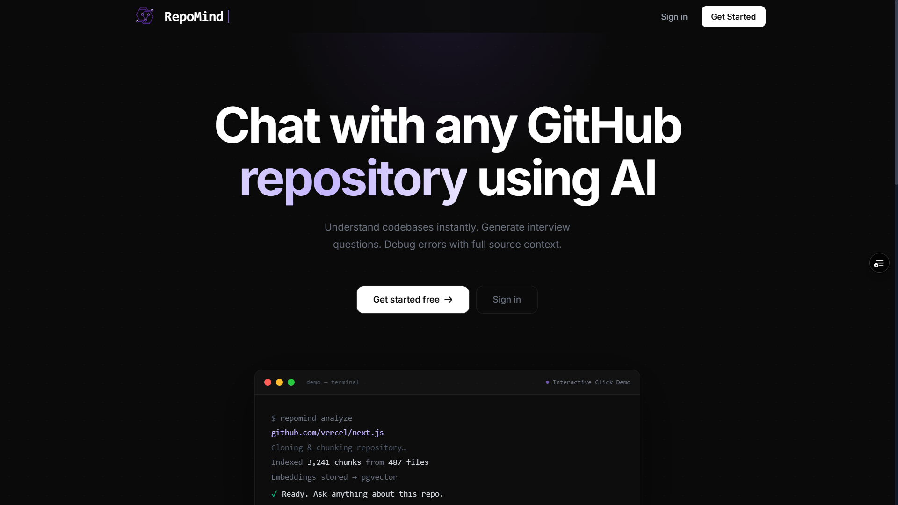
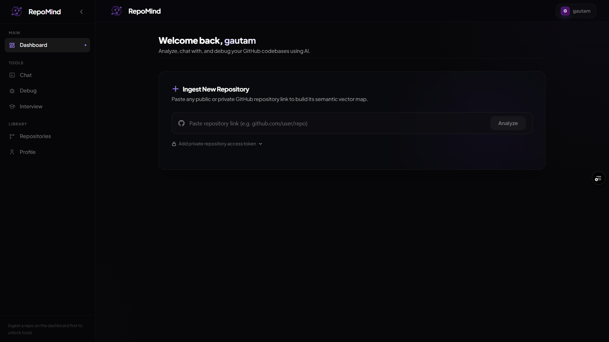
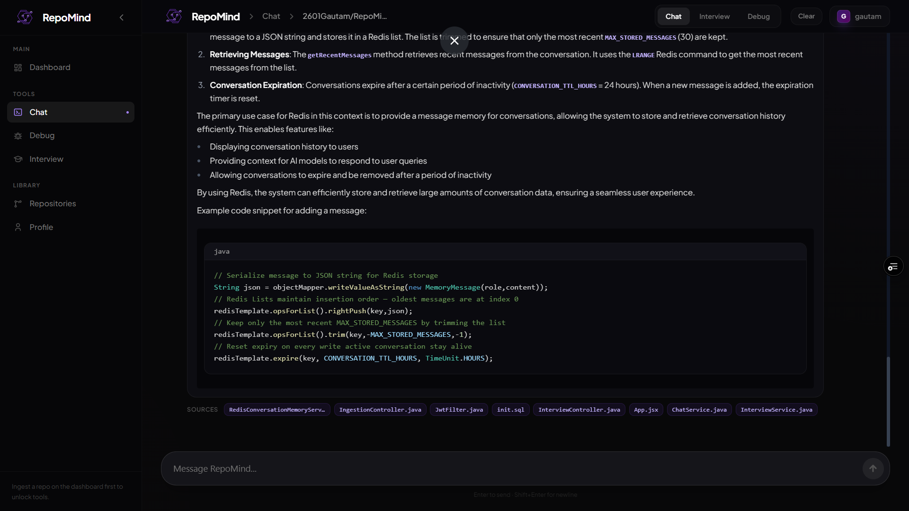
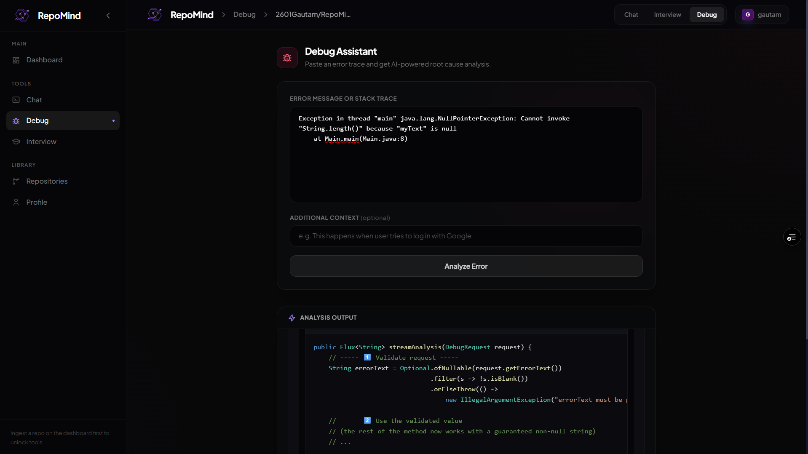
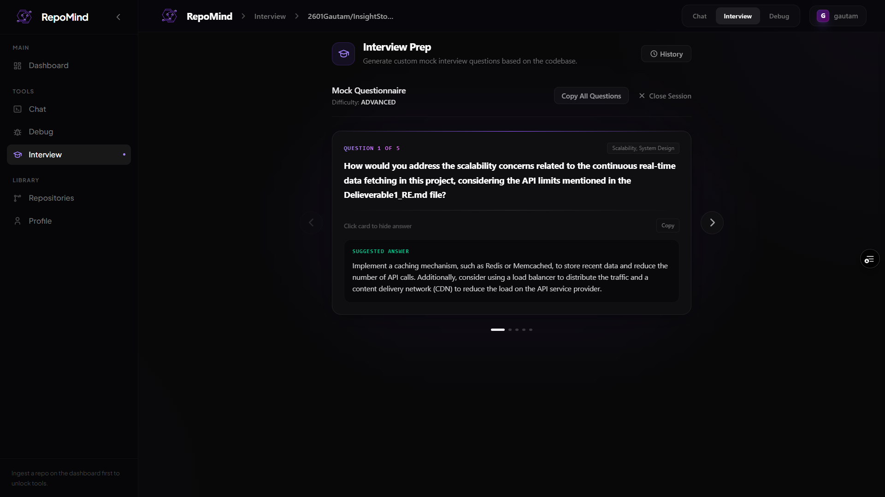

# RepoMind

### Chat with any GitHub repository — powered by Retrieval-Augmented Generation (RAG)

RepoMind ingests a public or private GitHub repository, understands its codebase, and lets you ask it questions in plain English — with answers grounded in the actual source code, not guesswork.

<p align="center">
  
  
  
  
  
  
  
  
</p>

---

## Table of Contents

- [Overview](#overview)
- [Problem Statement](#problem-statement)
- [Solution](#solution)
- [Key Features](#key-features)
- [Architecture](#architecture)
- [Technology Stack](#technology-stack)
- [Project Structure](#project-structure)
- [Getting Started](#getting-started)
- [Configuration and Environment Variables](#configuration-and-environment-variables)
- [Running Locally](#running-locally)
- [Docker](#docker)
- [Usage Guide](#usage-guide)
- [API Overview](#api-overview)
- [Screenshots](#screenshots)
- [Roadmap and Future Improvements](#roadmap-and-future-improvements)
- [Contributing](#contributing)
- [Authors](#authors)
- [Acknowledgements](#acknowledgements)

---

## Overview

**RepoMind** is a full-stack AI application that turns any GitHub repository into an interactive, queryable knowledge base. Point it at a repo URL, and once ingestion completes, you can chat with the codebase — ask where something is implemented, how a module works, or why a piece of logic exists — and get answers grounded in the real code, complete with file names and line numbers.

Beyond chat, RepoMind also includes an AI-assisted error/debug analyzer, an auto-generated interview Q&A feature based on the ingested codebase, and a durable AWS-backed ingestion pipeline.

## Problem Statement

Understanding an unfamiliar codebase — whether it's a new job's repo, an open-source project, or your own project months later — is slow. Traditional code search (grep, IDE search) requires knowing the right keywords, and reading through hundreds of files just to answer a simple architectural question doesn't scale. General-purpose AI chatbots can't help either, since they were never trained on your specific, often-private repository, and cannot fit an entire codebase into a single prompt.

## Solution

RepoMind solves this with **Retrieval-Augmented Generation (RAG)**:

1. The repository is cloned, split into overlapping code chunks, and converted into vector embeddings stored in PostgreSQL (via the `pgvector` extension).
2. When you ask a question, RepoMind embeds your question, retrieves the most semantically relevant chunks of code, and feeds them — along with your question — to an LLM.
3. The LLM is instructed to answer **only from the retrieved code**, and to say so explicitly if the answer isn't present, minimizing hallucination and keeping every answer traceable back to real files.

The result: accurate, source-grounded answers about a codebase the AI model has never seen before, without any fine-tuning.

---

## Key Features

- **Conversational Codebase Chat** — Ask natural-language questions about any ingested repository and get streamed, real-time answers (via Server-Sent Events) with cited source files.
- **Durable, Queue-Backed Ingestion** — Paste a GitHub URL; the API persists the job and publishes it to an Amazon SQS queue before returning `202 Accepted`, so an in-flight ingestion survives an application restart or redeploy instead of silently vanishing.
- **Context-Aware Chunking** — Uses a sliding-window chunking strategy with overlap so functions and logical blocks are never split across chunk boundaries.
- **Semantic Vector Search** — Powered by PostgreSQL's `pgvector` extension using cosine-similarity nearest-neighbor search, scoped per repository.
- **Multi-Turn Conversational Memory** — Redis-backed short-term memory (with TTL expiry) keeps track of recent conversation context so follow-up questions make sense, while PostgreSQL retains permanent chat history.
- **Incremental Repository Sync** — Re-syncing a repo diffs against its last indexed commit SHA instead of re-cloning and re-embedding everything from scratch.
- **Private Source Archival (Amazon S3)** — After ingestion, the extracted source is zipped and uploaded to a private S3 bucket, since the local clone is deleted to avoid filling server disk. Owners can request a short-lived (15-minute) presigned download URL for the archive.
- **Transactional Welcome Email (Amazon SES)** — New email/password registrations trigger an asynchronous welcome email via SES v2; a delivery failure never blocks registration.
- **AI-Powered Debug Analyzer** — A dedicated `/api/debug` flow using a lower-temperature "reasoning" LLM client tuned for careful error analysis.
- **Auto-Generated Interview Questions** — Generates structured interview-style Q&A based on the ingested repository, using a low-temperature, structured-output LLM client.
- **Secure Authentication** — Stateless JWT authentication (HttpOnly cookies), BCrypt password hashing, plus Google and GitHub OAuth2 login.
- **API Rate Limiting** — Token-bucket rate limiting (Bucket4j) applied declaratively via a custom `@RateLimit` annotation and an AOP aspect.
- **Real-Time Token Streaming** — Answers stream token-by-token to the frontend using reactive `Flux` + SSE, instead of waiting for the full response.
- **Per-User Repository Dashboard** — Every ingested repo, its ingestion status (`PENDING` / `PROCESSING` / `READY` / `FAILED`), and its conversations are scoped to the authenticated user.

---

## Architecture

### High-Level System Diagram


```mermaid
flowchart LR
    subgraph Client["Frontend (React 19 + Vite)"]
        UI["Chat / Ingest / Debug / Interview UI"]
    end

    subgraph Backend["Spring Boot Backend"]
        Auth["Auth (JWT + OAuth2)"]
        IngestAPI["IngestionController"]
        Consumer["IngestionQueueConsumer\n(4 worker pool)"]
        Chat["Chat Service"]
        Debug["Debug Service"]
        Interview["Interview Service"]
        RateLimit["Rate Limit Aspect (AOP)"]
    end

    subgraph Data["Data Layer"]
        PG[("PostgreSQL + pgvector")]
        Redis[("Redis\n(conversation memory + rate-limit buckets)")]
    end

    subgraph AWS["AWS"]
        SQS[("Amazon SQS\ningestion queue")]
        S3[("Amazon S3\nprivate source archives")]
        SES["Amazon SES v2\nwelcome email"]
    end

    subgraph External["External Services"]
        GH["GitHub (source repo, cloned via JGit)"]
        LLM["LLM APIs via OpenRouter\n(chat / reasoning / structured models)"]
        Mistral["Mistral AI\n(embeddings)"]
    end

    UI -->|REST + SSE| Backend
    IngestAPI -->|publish job| SQS
    SQS -->|long-poll| Consumer
    Consumer -->|clone| GH
    Consumer -->|zip + upload source| S3
    Consumer -->|store chunks + embeddings| PG
    Chat -->|vector similarity search| PG
    Chat -->|read/write short-term memory| Redis
    Chat -->|prompt + stream| LLM
    Chat -->|embed query| Mistral
    Debug --> LLM
    Interview --> LLM
    RateLimit --> Redis
    Auth --> PG
    Auth -->|welcome email| SES
```

### Ingestion Pipeline


```mermaid
sequenceDiagram
    participant User
    participant API as IngestionController
    participant SQS as Amazon SQS
    participant Consumer as IngestionQueueConsumer
    participant Svc as IngestionService
    participant Git as JGit
    participant S3 as Amazon S3
    participant Chunker as ChunkingService
    participant Embed as EmbeddingService
    participant DB as PostgreSQL (pgvector)

    User->>API: POST /api/repos/ingest {githubUrl}
    API->>DB: Save repository row (status: PENDING)
    API->>SQS: Publish ingestion job
    API-->>User: 202 Accepted (status: PENDING)
    SQS-->>Consumer: Long-poll delivers message
    Consumer->>Svc: processIngestionJob() [one of 4 worker threads]
    Svc->>Git: Clone repository
    Git-->>Svc: Local file tree
    Svc->>S3: Upload zipped source archive (best-effort)
    loop for each source file
        Svc->>Chunker: chunkFile(content)
        Chunker-->>Svc: Overlapping code chunks
        Svc->>Embed: embed(chunk text)
        Embed-->>Svc: embedding vector
        Svc->>DB: Save chunk + embedding
    end
    Svc->>DB: Update repo.status = READY
    Svc->>Git: Delete temp clone directory
    Consumer->>SQS: Delete message (only after a terminal DB state)
```

### Chat / Query Pipeline


```mermaid
sequenceDiagram
    participant User
    participant API as ChatController
    participant Svc as ChatService
    participant Redis
    participant DB as PostgreSQL (pgvector)
    participant LLM as OpenRouter (via Spring AI)

    User->>API: POST /api/chat {repoId, message}
    API->>Svc: streamChat()
    Svc->>Redis: getRecentMessages()
    Svc->>Svc: buildRetrievalQuery(history + question)
    Svc->>DB: vector similarity search (top 8 chunks)
    DB-->>Svc: Relevant code chunks
    Svc->>LLM: stream(systemPrompt, userPrompt + context)
    LLM-->>Svc: token stream
    Svc-->>User: SSE token events (real-time)
    Svc->>Redis: save message (short-term memory)
    Svc->>DB: save message (permanent history)
```

> **Note on ingestion status:** the schema (`init.sql`) defines a `PENDING → PROCESSING → READY/FAILED` state machine. A repository sits in `PENDING` from the moment its row is created until an `IngestionQueueConsumer` worker picks up the SQS message and moves it to `PROCESSING`.

---

## Technology Stack

### Backend
| Category | Technology |
|---|---|
| Language | Java 21 |
| Framework | Spring Boot |
| AI Orchestration | Spring AI 2.0.0 (`spring-ai-starter-model-openai`, `spring-ai-starter-model-mistral-ai`) |
| LLM Provider | Routed through [OpenRouter](https://openrouter.ai) (OpenAI-compatible endpoint), so the underlying model per role (chat / reasoning / structured / summary) is configurable without a code change |
| Embedding Model | Mistral AI (`mistral-embed`) |
| Database | PostgreSQL with the `pgvector` extension |
| Caching / Memory | Redis (`spring-boot-starter-data-redis`) |
| Background Jobs | Amazon SQS — durable ingestion queue, long-polled by a bounded worker pool |
| Object Storage | Amazon S3 — private, presigned-URL-only archive of each ingested repository's source |
| Transactional Email | Amazon SES v2 — async welcome email on registration |
| Auth | JWT (`jjwt-api`, `jjwt-impl`, `jjwt-jackson`), Spring Security, OAuth2 Client (Google & GitHub) |
| Rate Limiting | Bucket4j (`bucket4j_jdk17-core`, `bucket4j_jdk17-lettuce`) via a custom AOP aspect, with buckets stored in Redis so limits hold across multiple backend instances |
| Repository Access | JGit (`org.eclipse.jgit`) |
| Reactive/Streaming | Spring WebFlux (`Flux`), Server-Sent Events |
| Utilities | Lombok, Spring Retry, Spring Dotenv, AWS SDK for Java v2 (S3, SQS, SES) |
| Build Tool | Maven (via `mvnw` wrapper) |

### Frontend
| Category | Technology |
|---|---|
| Framework | React 19 |
| Build Tool | Vite |
| Routing | React Router |
| Styling | Tailwind CSS (`@tailwindcss/typography`) |
| HTTP Client | Axios |
| Markdown / Code Rendering | `react-markdown`, `remark-gfm`, `react-syntax-highlighter` |
| Icons | `lucide-react` |

### Infrastructure
| Category | Technology |
|---|---|
| Containerization | Docker (multi-stage build: Maven → Eclipse Temurin JRE Alpine) |
| Backend Hosting | Render |
| Frontend Hosting | Vercel |
| Database Hosting | NeonDB (managed PostgreSQL, referenced in `application-prod.yml`) |
| Background Queue / Storage / Email | AWS (SQS, S3, SES) — see [AWS_SERVICES_EXPLAINED.md](AWS_SERVICES_EXPLAINED.md) for the full setup and design rationale |

---

## Project Structure

```
RepoMind/
├── Dockerfile                          # Multi-stage build: Maven build → JRE Alpine runtime
├── init.sql                            # Database schema: users, repositories, code_chunks, etc.
├── pom.xml                             # Maven dependencies & build config
├── mvnw / mvnw.cmd                     # Maven wrapper scripts
├── AWS_SERVICES_EXPLAINED.md           # Deep dive: why/how SQS, S3, SES, and IAM are used
├── SETUP_AWS.md                        # Step-by-step AWS console setup guide
│
├── src/main/java/com/repomind/repomind/
│   ├── config/                         # AiConfig (LLM beans), AwsConfig (S3/SQS/SES clients),
│   │                                    # SecurityConfig, JacksonConfig
│   ├── controller/                     # ChatController, IngestionController, DebugController,
│   │                                    # AuthController, InterviewController, HealthController
│   ├── service/
│   │   ├── ingestion/                  # FileCloneService, ChunkingService, EmbeddingService,
│   │   │                                # GitHubApiService, SyncService, IngestionService
│   │   ├── queue/                      # IngestionQueuePublisher, IngestionQueueConsumer (SQS)
│   │   ├── ChatService.java            # Core RAG chat/streaming logic
│   │   ├── S3StorageService.java       # Repo-archive upload/download/delete on S3
│   │   ├── EmailService.java           # SES welcome email
│   │   ├── RedisConversationMemoryService.java
│   │   ├── RateLimitService.java
│   │   └── PromptBuilder.java
│   ├── security/                       # JwtFilter, JwtUtil, OAuth2SuccessHandler
│   ├── aspect/                         # RateLimitAspect (AOP)
│   ├── repository/                     # Spring Data JPA repositories (incl. native pgvector query)
│   ├── model/entity/                   # User, RepoEntity, CodeChunk, Conversation, Message, etc.
│   ├── dto/                            # request/, response/, queue/ (IngestionJobMessage) DTOs
│   └── annotation/                     # Custom @RateLimit annotation
│
├── src/main/resources/
│   ├── application.yml                 # Base configuration (incl. AWS properties)
│   └── application-prod.yml            # Production overrides (DB, Redis, OAuth2, model routing)
│
└── frontend/
    ├── package.json
    ├── vite.config.js
    └── src/
        ├── api/client.js                # Axios API client
        ├── context/AuthContext.jsx      # Auth state management
        ├── components/
        │   ├── chat/  debug/  repo/  layout/  common/
        └── pages/
            ├── LandingPage.jsx
            ├── LoginPage.jsx / RegisterPage.jsx / OAuthCallbackPage.jsx
            ├── DashboardPage.jsx / AllReposPage.jsx
            ├── IngestPage.jsx
            ├── ChatPage.jsx
            ├── DebugPage.jsx
            ├── InterviewPage.jsx
            └── ProfilePage.jsx
```

---

## Getting Started

### Prerequisites

- **Java 21** (JDK)
- **Maven** (or use the included `mvnw` wrapper)
- **Node.js** (v18+) and **npm** — for the frontend
- **PostgreSQL** with the `pgvector` extension installed
- **Redis** (local instance or a managed service)
- An **AWS account** with an SQS queue, S3 bucket, and SES-verified sender — see [SETUP_AWS.md](SETUP_AWS.md) (the app requires `AWS_SQS_INGESTION_QUEUE_URL` at startup)
- API keys for:
  - **OpenRouter** (chat/reasoning/structured LLM inference)
  - **Mistral AI** (embeddings)
  - **Google OAuth2** and **GitHub OAuth2** (optional, only if you want social login)

### Clone the repository

```bash
git clone https://github.com/2601Gautam/RepoMind.git
cd RepoMind
```

---

## Configuration and Environment Variables

RepoMind reads secrets and environment-specific values via environment variables (loaded through `spring-dotenv`, i.e. a `.env` file at the project root, or your platform's native environment variables). Based on `application.yml` and `application-prod.yml`, the following variables are used:

| Variable | Required | Description |
|---|---|---|
| `JWT_SECRET` | Yes | Secret key used to sign JWTs. Must be at least 256 bits (32+ characters). |
| `DATABASE_URL` | Yes (prod) | PostgreSQL connection string (e.g. from NeonDB). |
| `DB_USER` | Yes (prod) | Database username. |
| `DB_PASSWORD` | Yes (prod) | Database password. |
| `REDIS_URL` | Yes (prod) | Redis connection URL. |
| `OPENROUTER_API_KEY` | Yes | API key for OpenRouter (routes to the configured chat/reasoning/structured LLMs). |
| `CHAT_MODEL` | No | Overrides the fast chat model used for normal conversation (defaults to `openrouter/free`). |
| `REASONING_MODEL` | No | Overrides the model used by the debug analyzer. |
| `STRUCTURED_MODEL` | No | Overrides the model used for structured/interview output. |
| `SUMMARY_MODEL` | Yes (prod) | Model used to summarize/condense conversation context. |
| `MISTRAL_API_KEY` | Yes | API key for Mistral AI (used for embeddings). |
| `AWS_ACCESS_KEY_ID` / `AWS_SECRET_ACCESS_KEY` | Yes | Static credentials for the dedicated least-privilege IAM user (S3, SQS, SES). |
| `AWS_REGION` | No | Defaults to `ap-south-1`. |
| `AWS_S3_BUCKET` | Yes | Bucket for private per-repository source archives. |
| `AWS_SES_FROM_EMAIL` | Yes | Verified SES sender address for the welcome email. |
| `AWS_SQS_INGESTION_QUEUE_URL` | Yes | No fallback — the app fails at startup without it, since accepting an ingestion request without a durable queue behind it would be misleading. |
| `AWS_SQS_CONSUMER_ENABLED` | No | Defaults to `true`. Set to `false` only in tests, to stop a test context from polling AWS. |
| `GOOGLE_CLIENT_ID` / `GOOGLE_CLIENT_SECRET` | No | Required only if enabling Google OAuth2 login. |
| `GITHUB_CLIENT_ID` / `GITHUB_CLIENT_SECRET` | No | Required only if enabling GitHub OAuth2 login. |
| `CORS_ALLOWED_ORIGIN` | No | Frontend origin allowed by CORS (defaults to `http://localhost:5173`). |

> **Note:** The repository does not include a `.env.example` file. Create your own `.env` file in the project root based on the table above before running the app. Never commit real secrets to version control.

Example `.env` (for local development):

```env
JWT_SECRET=replace_with_a_long_random_secret_at_least_32_characters
DATABASE_URL=jdbc:postgresql://localhost:5432/repomind
DB_USER=postgres
DB_PASSWORD=postgres
REDIS_URL=redis://localhost:6379
OPENROUTER_API_KEY=your_openrouter_api_key
MISTRAL_API_KEY=your_mistral_api_key
AWS_ACCESS_KEY_ID=your_iam_access_key_id
AWS_SECRET_ACCESS_KEY=your_iam_secret_access_key
AWS_REGION=ap-south-1
AWS_S3_BUCKET=repomind-dev-archives
AWS_SES_FROM_EMAIL=verified-sender@example.com
AWS_SQS_INGESTION_QUEUE_URL=https://sqs.ap-south-1.amazonaws.com/123456789012/repomind-dev-ingestion
CORS_ALLOWED_ORIGIN=http://localhost:5173
```

See [SETUP_AWS.md](SETUP_AWS.md) for how to create the queue, bucket, SES identity, and IAM user referenced above.

### Database Setup

Run the provided `init.sql` against your PostgreSQL instance to create the required extensions (`vector`, `uuid-ossp`) and tables (`users`, `repositories`, `code_chunks`, and related tables):

```bash
psql -U postgres -d repomind -f init.sql
```

For an existing deployment, run the privacy migration before deploying the
application update:

```bash
psql -U postgres -d repomind -f migrations/20260902_add_repository_is_private.sql
psql -U postgres -d repomind -f migrations/20260902_enforce_unique_repository_urls.sql
```

> Note: `application.yml` sets `ddl-auto: validate` — meaning Hibernate will **validate** the schema against your entities but will **not** auto-create tables. Running `init.sql` first is required.

---

## Running Locally

### 1. Backend (Spring Boot)

```bash
./mvnw clean install
./mvnw spring-boot:run
```

The backend starts on `http://localhost:8080` by default (Spring Boot's default port, unless configured otherwise).

### 2. Frontend (React + Vite)

```bash
cd frontend
npm install
npm run dev
```

The frontend starts on Vite's default dev server (typically `http://localhost:5173`).

> Vite bakes environment variables into the build **at build time**. If you configure a custom API base URL for the frontend, make sure it's set correctly before running `npm run build` for production.

---

## Docker

A `Dockerfile` is provided for the **backend** using a multi-stage build (Maven build stage → lightweight Eclipse Temurin JRE Alpine runtime image):

```bash
# Build the image
docker build -t repomind-backend .

# Run the container
docker run -p 8080:8080 --env-file .env repomind-backend
```

> Note: The repository currently provides a Dockerfile for the **backend only**. There is no `docker-compose.yml` or frontend Dockerfile in the repo at this time — running PostgreSQL, Redis, and the frontend locally alongside the container is a manual setup step.

---

## Usage Guide

1. **Register / Log in** — create an account (email/password) or sign in with Google/GitHub OAuth2. A new email/password registration triggers an async welcome email via SES.
2. **Ingest a Repository** — from the dashboard, submit a public (or token-authenticated private) GitHub repository URL. The API queues the job on SQS and returns `202 Accepted`; a worker clones, archives to S3, chunks, and embeds it in the background, and progress is shown via polling the repo's status.
3. **Chat** — once a repo's status is `READY`, open the Chat page and ask questions in natural language. Answers stream in real time and cite the specific files they were drawn from.
4. **Debug** — use the Debug page to paste an error/stack trace and get an AI-assisted analysis grounded in the ingested repository's code.
5. **Interview Prep** — generate structured interview-style questions and answers based on the ingested codebase from the Interview page.
6. **Sync** — re-sync a `READY` repository to pick up new commits without a full re-ingestion.
7. **Download Archive** — request a 15-minute presigned S3 download link for the exact source snapshot that was indexed.
8. **Manage Repositories** — view all your ingested repositories, their status, and delete ones you no longer need from the "All Repos" page.

---

## API Overview

All endpoints are prefixed under `/api`. Authentication uses a JWT stored in an HttpOnly cookie, set after login/registration/OAuth2.

### Auth — `/api/auth`
| Method | Endpoint | Description |
|---|---|---|
| POST | `/api/auth/register` | Register a new user (triggers an async SES welcome email) |
| POST | `/api/auth/login` | Log in and receive a JWT (HttpOnly cookie) |
| GET | `/api/auth/me` | Get the current authenticated user |
| POST | `/api/auth/logout` | Log out (clears the auth cookie) |
| GET | `/api/auth/profile/stats` | Get profile statistics for the current user |

### Repository Ingestion — `/api/repos`
| Method | Endpoint | Description |
|---|---|---|
| POST | `/api/repos/ingest` | Submit a GitHub URL; the job is durably queued on SQS. Returns `202 Accepted`. |
| POST | `/api/repos/{repoId}/sync` | Incrementally re-sync a `READY` repository against its last-indexed commit |
| GET | `/api/repos/{repoId}/status` | Poll ingestion status/progress |
| GET | `/api/repos/{repoId}/archive` | Get a 15-minute presigned S3 download URL for the repo's source archive |
| GET | `/api/repos` | List all repositories for the current user |
| DELETE | `/api/repos/{repoId}` | Remove this user's access; if no user has access left, delete the repo, its chunks, and its S3 archive |

### Chat — `/api/chat`
| Method | Endpoint | Description |
|---|---|---|
| POST | `/api/chat` | Ask a question; streams the answer via Server-Sent Events |
| GET | `/api/chat/history/{repoId}` | Get chat history for a repository |
| DELETE | `/api/chat/conversations/{conversationId}` | Delete a conversation |

### Debug — `/api/debug`
| Method | Endpoint | Description |
|---|---|---|
| POST | `/api/debug/analyze` | Stream an AI-assisted analysis of an error/bug, grounded in the ingested repo |

### Interview — `/api/interview`
| Method | Endpoint | Description |
|---|---|---|
| POST | `/api/interview/generate` | Generate structured interview Q&A for a repository |
| GET | `/api/interview/sessions/{sessionId}` | Get a specific interview session |
| GET | `/api/interview/sessions` | List all interview sessions for the current user |

### Health — `/api/health` *(inferred base path)*
| Method | Endpoint | Description |
|---|---|---|
| GET | `/health` | Health check endpoint (used for uptime pings) |

> Formal API documentation (e.g. Swagger/OpenAPI) is not currently generated in this repository — the table above is derived directly from the controller source code.

---

## Screenshots

### Landing Page


### Dashboard


### Chat Interface


### Debug Analyzer


### Interview Prep


---

## Roadmap and Future Improvements

- [ ] **Query condensing** — use a dedicated LLM call to rewrite follow-up questions into standalone queries for more accurate retrieval (current implementation composites the last 2 messages + the current one, which can degrade retrieval confidence on topic changes).
- [x] ~~Distributed rate limiting~~ — done. Rate-limit buckets are Redis-backed (`DistributedRateLimitConfig` + `bucket4j_jdk17-lettuce`), so limits hold across multiple backend instances instead of resetting per instance. (The `@Cacheable` cache manager was already Redis-backed via `spring.cache.type: redis` — an earlier version of this README incorrectly listed it here as still pending.)
- [ ] **API documentation** — add Swagger/OpenAPI documentation for all endpoints.
- [ ] **Automated tests** — expand test coverage (currently scaffolded via `spring-boot-starter-test` and `spring-security-test`); add mocked SQS/S3/SES unit tests and LocalStack integration tests for the AWS layer.
- [ ] **Docker Compose** — provide a full `docker-compose.yml` covering backend, frontend, PostgreSQL, and Redis for one-command local setup.
- [ ] **Re-index from S3** — use the archived source ZIP to re-embed a repository (new chunking strategy, new embedding model) without re-cloning from GitHub.
- [ ] **Short-lived GitHub tokens for private repos** — migrate the SQS ingestion job's GitHub token to a short-lived GitHub App installation token instead of a long-lived PAT.
- [ ] **License** — add an explicit open-source license.

---

## Contributing

Contributions are welcome! To contribute:

1. Fork the repository
2. Create a feature branch: `git checkout -b feature/your-feature-name`
3. Commit your changes: `git commit -m "Add your feature"`
4. Push to your branch: `git push origin feature/your-feature-name`
5. Open a Pull Request describing your changes

Please open an issue first for major changes to discuss what you'd like to change.

---

## Authors

**Gautam Modi** ([@2601Gautam](https://github.com/2601Gautam))
B.Tech ICT student, Dhirubhai Ambani University (DAU), Gandhinagar

**Diya Patel** ([@DiyaPatel007](https://github.com/DiyaPatel007))
B.Tech ICT-CS student, Dhirubhai Ambani University (DAU), Gandhinagar

---

## Acknowledgements

- [Spring AI](https://spring.io/projects/spring-ai) — for LLM/embedding orchestration within the Spring ecosystem
- [pgvector](https://github.com/pgvector/pgvector) — for enabling vector similarity search directly in PostgreSQL
- [OpenRouter](https://openrouter.ai/) — for unified, swappable access to multiple LLM providers
- [Mistral AI](https://mistral.ai/) — for the embedding model
- [JGit](https://www.eclipse.org/jgit/) — for pure-Java Git repository access
- [Bucket4j](https://bucket4j.com/) — for token-bucket rate limiting
- [AWS SDK for Java v2](https://github.com/aws/aws-sdk-java-v2) — for SQS, S3, and SES integration
- [NeonDB](https://neon.tech/) — managed serverless PostgreSQL used in production
